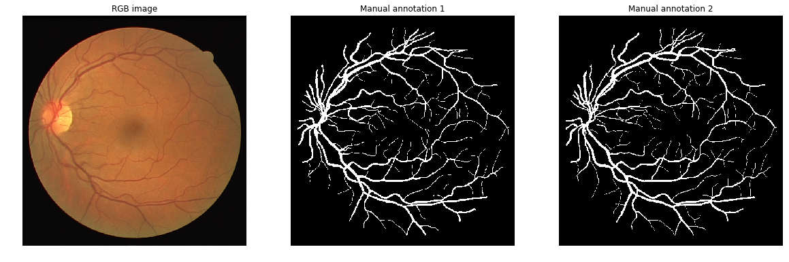

# EXAMEN_COMPUTER_VISION
CURSO COMPUTER VISION MAESTRIA EN IA - UNI

En el presente repositorio se encuentra la base de datos de DRIVE que contiene datos de imágenes de RITINOPATIA.

## INTEGRANTES
GRUPO 7:
- Moises Meza Rodriguez
- Aradiel 
- Deybi Estacio
- Fernando Garcia Atuncar

## SOBRE DRIVE
La base de datos DRIVE se creó para permitir estudios comparativos sobre la segmentación de vasos sanguíneos en imágenes retinianas. La segmentación de vasos retinianos y la delineación de sus atributos morfológicos, como longitud, anchura, tortuosidad, patrones de ramificación y ángulos, se utilizan para el diagnóstico, cribado, tratamiento y evaluación de diversas enfermedades cardiovasculares y oftalmológicas, como la diabetes, la hipertensión, la arteriosclerosis y la neovascularización coroidea. La detección y el análisis automáticos de la vasculatura pueden facilitar la implementación de programas de cribado de la retinopatía diabética, la investigación sobre la relación entre la tortuosidad vascular y la retinopatía hipertensiva, la medición del diámetro vascular en relación con el diagnóstico de la hipertensión y la cirugía láser asistida por ordenador. La generación automática de mapas retinianos y la extracción de puntos de ramificación se han utilizado para el registro temporal o multimodal de imágenes y la síntesis de mosaicos de imágenes retinianas. Además, el árbol vascular retiniano es único para cada individuo y puede utilizarse para la identificación biométrica.

## DATA 
Las fotografías para la base de datos DRIVE se obtuvieron de un programa de cribado de retinopatía diabética en los Países Bajos. La población de cribado consistió en 400 sujetos diabéticos de entre 25 y 90 años. Se seleccionaron al azar cuarenta fotografías: 33 no muestran signos de retinopatía diabética y 7 muestran signos de retinopatía diabética temprana leve. A continuación, se presenta una breve descripción de las anomalías en estos 7 casos:

* 25_training: cambios en el epitelio pigmentario, probablemente maculopatía en mariposa con cicatriz pigmentada en la fóvea o coroidopatía; sin retinopatía diabética ni otras anomalías vasculares. 26_entrenamiento: retinopatía diabética de base, atrofia del epitelio pigmentario, atrofia alrededor del disco óptico
* 32_entrenamiento: retinopatía diabética de base

* 03_prueba: retinopatía diabética de base
* 08_prueba: cambios en el epitelio pigmentario, cicatriz pigmentada en la fóvea o coroidopatía, sin retinopatía diabética ni otras anomalías vasculares
* 14_prueba: retinopatía diabética de base
* 17_prueba: retinopatía diabética de base

Cada imagen se ha comprimido en formato JPEG.

Las imágenes se adquirieron con una cámara Canon CR5 3CCD no midriática con un campo de visión (FOV) de 45 grados. Cada imagen se capturó con 8 bits por plano de color a 768 x 584 píxeles. El FOV de cada imagen es circular, con un diámetro aproximado de 540 píxeles. Para esta base de datos, las imágenes se han recortado alrededor del FOV. Para cada imagen, se proporciona una imagen de máscara que delimita el campo de visión (FOV).

El conjunto de 40 imágenes se ha dividido en un conjunto de entrenamiento y uno de prueba, ambos con 20 imágenes. Para las imágenes de entrenamiento, se dispone de una única segmentación manual de la vasculatura. Para los casos de prueba, no se ofrecen anotaciones; podrá enviar sus predicciones a este sitio y compararlas con el estándar de referencia. Además, se dispone de una imagen de máscara para cada imagen retiniana, que indica la región de interés. Todos los observadores humanos que segmentaron manualmente la vasculatura fueron instruidos y entrenados por un oftalmólogo experimentado. Se les pidió que marcaran todos los píxeles que tenían al menos un 70 % de certeza de que eran vasos.
